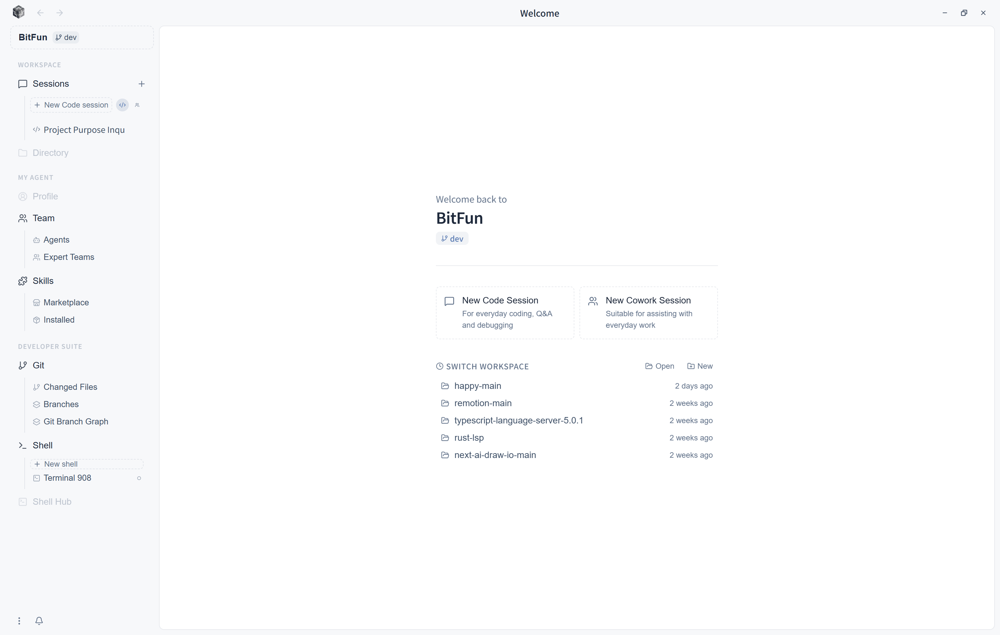

[中文](README.zh-CN.md) | **English**

<div align="center">


</div>
<div align="center">

[](https://github.com/GCWing/BitFun/releases)
[](https://github.com/GCWing/BitFun/blob/main/LICENSE)
[](https://github.com/GCWing/BitFun)

</div>

---

## A Word Up Front

In the age of AI, true human–machine collaboration isn't just a ChatBox — it's a partner that knows you, accompanies you, and gets things done for you anywhere, anytime. That's where BitFun's exploration begins.

## What Is BitFun

BitFun is a next-generation Agent system built around the idea of **"AI assistants with personality and memory"**.

Every user has their own Agent assistant — one that remembers your habits and preferences, carries a unique personality, and keeps growing over time. On top of this assistant, BitFun ships with two built-in capabilities: **Code Agent** (coding assistant) and **Cowork Agent** (knowledge work assistant), along with a unified extension mechanism to define additional Agent roles as needed.

Your assistant isn't confined to the desktop — it can be reached through multiple channels, such as WeChat, Telegram, WhatsApp, and other social platforms, letting you issue instructions anytime, anywhere. Tasks keep running in the background, and you check in or give feedback whenever convenient.

Built with **Rust + TypeScript** for an ultra-lightweight, fluid, cross-platform experience.



### Agent System

| Agent | Role | Core Capabilities |
|---|---|---|
| **Personal Assistant (WIP🚧)** (default) | Your dedicated AI companion | Long-term memory, personality settings, cross-scenario orchestration, continuous growth |
| **Code Agent** | Coding assistant | Conversation-driven coding, multi-mode task execution, autonomous read / edit / run / verify |
| **Cowork Agent** | Knowledge work assistant | File management, document generation, report organization, autonomous multi-step task execution |
| **Custom Agent** | Domain specialist | Quickly define a domain-specific Agent with Markdown |

### Code Agent Working Modes

Code Agent is built for software development, offering multiple modes that cover the full cycle from day-to-day coding to deep debugging, with deep integration into MCP, Skills, and Rules:

| Mode | Scenario | Characteristics |
|------|----------|-----------------|
| **Agentic** | Day-to-day coding | Conversation-driven; AI autonomously reads, edits, runs, and verifies. |
| **Plan** | Complex tasks | Plan first, then execute; align on critical changes upfront. |
| **Debug** | Hard problems | Instrument & trace → compare paths → root-cause analysis → verify fix. |
| **Review** | Code review | Review code based on key repository conventions. |

### Cowork Agent Workflow

Cowork Agent is designed for everyday work, following a "clarify first, execute next, stay trackable" collaboration principle, with built-in office Skills and access to the Skill marketplace:

| Skill | Trigger | Core Capabilities |
|---|---|---|
| **PDF** | Working with .pdf files | Read/extract text & tables, merge/split/rotate, watermark, fill forms, encrypt/decrypt, OCR scanned PDFs |
| **DOCX** | Create or edit Word documents | Create/edit .docx, styles/TOC/headers & footers, image insertion, comments & tracked changes |
| **XLSX** | Working with spreadsheets | Create/analyze .xlsx/.csv, formulas & formatting, financial model standards (color coding, formula validation) |
| **PPTX** | Build presentations | Create/edit .pptx from scratch, visual design guidelines, automated visual QA |
| **agent-browser** | Browser interaction needed | Browser automation: open pages, click/fill forms, screenshot, scrape data, web app testing |
| **skill-creator** | Creating a custom Skill | Guides authoring new Skills to extend the Agent's domain-specific capabilities |
| **find-skills** | Looking for ready-made capabilities | Discover and install community-contributed reusable Skills from the Skill marketplace |

---

### Extensibility

- **MCP Protocol**: Extend with external tools and resources via MCP servers; supports MCP Apps.
- **Skills**: Markdown/script-based capability packages that teach the Agent specific tasks (auto-reads Cursor, Claude Code, Codex configs).
- **Agent Customization**: Quickly define a specialized Agent's personality, memory scope, and capabilities with Markdown.
- **Rules**: Project/global-level convention injection; auto-reads Cursor and other mainstream tool configs.
- **Hooks (WIP🚧)**: Inject deterministic automation logic at key task milestones.

---


## Quick Start

### Use Directly

Download the latest installer for the desktop app from [Release](https://github.com/GCWing/BitFun/releases). After installation, configure your model and you're ready to go.

Other form factors are currently only specification drafts and not yet developed. If needed, please build from source.

### Build from Source

Make sure you have the following prerequisites installed:

- Node.js (LTS recommended)
- Rust toolchain (install via [rustup](https://rustup.rs/))
- [Tauri prerequisites](https://v2.tauri.app/start/prerequisites/) for desktop development

```bash
# Install dependencies
npm install

# Run desktop app in development mode
npm run desktop:dev

# Build desktop app
npm run desktop:build
```

For more details, see the [Contributing Guide](./CONTRIBUTING.md).

## Platform Support

The project uses a Rust + TypeScript tech stack, supporting cross-platform and multi-form-factor reuse — keeping your Agent assistant always online and reachable everywhere.

| Form Factor | Supported Platforms | Status |
|-------------|---------------------|--------|
| **Desktop** (Tauri) | Windows, macOS | ✅ Supported |
| **CLI** | Windows, macOS, Linux | 🚧 In Development |
| **Server** | - | 🚧 In Development |
| **Mobile** (Native App) | iOS, Android | 🚧 In Development |
| **Social Platform Integration** | WeChat, Telegram, WhatsApp, Discord, etc. | 🚧 In Development |


## Contributing
We welcome great ideas and code contributions. We are maximally accepting of AI-generated code. Please submit PRs to the dev branch first; we will periodically review and sync to the main branch.

Key contribution areas we focus on:
1. Contributing good ideas/creativity (features, interactions, visuals, etc.), submit issues
2. Optimizing the Agent system and its effectiveness
3. Improving system stability and foundational capabilities
4. Expanding the ecosystem (Skills, MCP, LSP plugins, or better support for specific vertical development scenarios)


## Disclaimer
1. This project is built in spare time for exploring and researching next-generation human–machine collaborative interaction, not for commercial profit.
2. 97%+ of this project was built with Vibe Coding. Feedback on code issues is also welcome—refactoring and optimization can be done via AI.
3. This project depends on and references many open-source projects. Thanks to all open-source authors. **If your rights are affected, please contact us for rectification.**

---
<div align="center">
The world is being rewritten—this time, we are all holding the pen.
</div>
