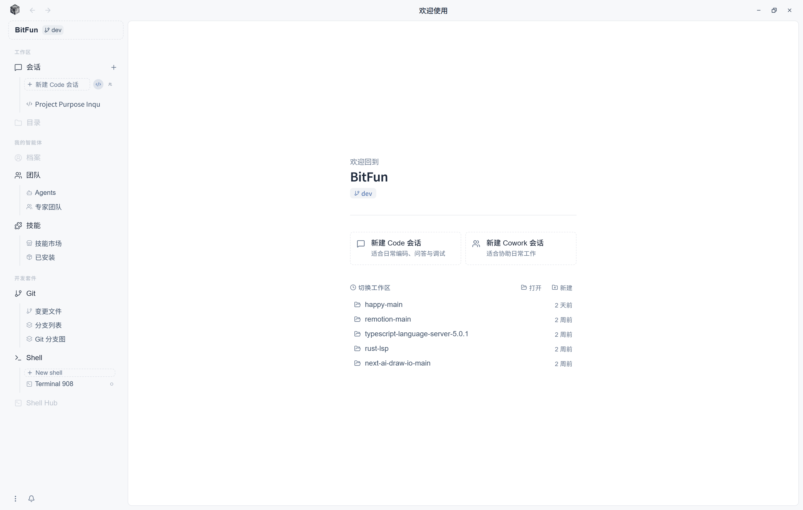

**中文** | [English](README.md)

<div align="center">


</div>
<div align="center">

[](https://github.com/GCWing/BitFun/releases)
[](https://github.com/GCWing/BitFun/blob/main/LICENSE)
[](https://github.com/GCWing/BitFun)

</div>

---

## 写在前面的话

AI 时代，真正的人机协同不是简单的ChatBox，而是一个懂你、陪你并且随时随地替你做事的伙伴。BitFun 的探索，从这里开始。

## 什么是 BitFun

BitFun 是一个以 **"有个性、有记忆的 AI 助理"** 为核心的新一代 Agent 系统。

每一位用户都拥有属于自己的 Agent 助理——它记得你的习惯与偏好，拥有独特的性格设定，并随时间持续成长。在这个助理之上，BitFun 默认内置了 **Code Agent**（代码代理）与 **Cowork Agent**（桌面端工作助理）两种专业能力，并提供统一的扩展机制供用户按需定制更多 Agent 角色。

你的助理不只存在于桌面——可以通过多种媒体方式联系，比如通过微信、Telegram、WhatsApp 等社交平台，都可以随时随地向它下达指令，任务在后台持续推进，你只需在方便时查看进度或给出反馈。

以 **Rust + TypeScript** 构建，追求极致轻量与流畅的跨平台体验。



### Agent 体系

| Agent | 定位 | 核心能力 |
|---|---|---|
| **个人助理（WIP🚧）**（默认） | 你专属的 AI 伙伴 | 长期记忆、个性设定、跨场景调度、持续成长 |
| **Code Agent** | 代码代理 | 对话驱动编码，多模式任务执行，自主读/改/跑/验证 |
| **Cowork Agent** | 知识工作代理 | 文件管理、文档生成、报告整理、多步任务自主执行 |
| **自定义 Agent** | 垂域专家 | 通过 Markdown 快速定义专属领域 Agent |

### Code Agent 工作模式

Code Agent 专为软件开发设计，支持多种工作模式覆盖从日常编码到疑难排查的全流程，并深度集成 MCP、Skills、Rules 等扩展体系：

| 模式 | 场景 | 特点 |
|---|---|---|
| **Agentic** | 日常编码 | 对话驱动，AI 自主完成读/改/跑/验证 |
| **Plan** | 复杂任务 | 先规划后执行，关键改动点提前对齐 |
| **Debug** | 疑难问题 | 插桩取证 → 路径对比 → 根因定位 → 验证修复 |
| **Review** | 代码审查 | 基于仓库关键规范进行代码审查 |


### Cowork Agent 工作方式

Cowork Agent 专为日常工作设计，遵循"先澄清、再执行、可追踪"的协作原则，内置多个常用办公Skill，并对接skill市场：

| Skill | 触发场景 | 核心能力 |
|---|---|---|
| **PDF** | 处理 .pdf 文件 | 读取/提取文本与表格、合并/拆分/旋转、添加水印、填写表单、加密解密、OCR 扫描版 |
| **DOCX** | 创建或编辑 Word 文档 | 创建/编辑 .docx、样式/目录/页眉页脚、插入图片、批注与追踪修订 |
| **XLSX** | 处理电子表格 | 创建/分析 .xlsx/.csv，公式与格式化，财务模型规范（颜色编码、公式校验） |
| **PPTX** | 制作演示文稿 | 从零创建/编辑 .pptx，视觉设计规范，自动 QA 视觉检查 |
| **agent-browser** | 需要操控网页 | 浏览器自动化：打开网页、点击/填表、截图、抓取数据、Web 测试 |
| **skill-creator** | 创建自定义 Skill | 引导创作新 Skill，扩展 Agent 的专业能力范围 |
| **find-skills** | 寻找现成能力包 | 从 Skill 市场发现并安装社区贡献的可复用 Skill |

---

### 扩展能力

- **MCP 协议**：通过 MCP 服务器扩展外部工具与资源，支持MCP APP
- **Skills**：Markdown/脚本等能力包，教 Agent 完成特定任务（自动读取 Cursor、Claude Code、Codex 等配置）
- **Agent 自定义**：通过 Markdown 快速定义专属 Agent 的性格、记忆与能力范围
- **Rules**：项目/全局级规范注入，自动读取 Cursor 等主流工具配置
- **Hooks（WIP🚧）**：在任务关键节点注入确定性自动化逻辑

---


## 快速开始

### 直接使用

桌面端程序在 [Release](https://github.com/GCWing/BitFun/releases) 处下载最新安装包，安装后配置模型即可开始使用。

其他形态暂时仅是规范雏形未完成开发，如有需要请从源码构建。

### 从源码构建

请确保已安装以下前置依赖：

- Node.js（推荐 LTS 版本）
- Rust 工具链（通过 [rustup](https://rustup.rs/) 安装）
- [Tauri 前置依赖](https://v2.tauri.app/start/prerequisites/)（桌面端开发需要）

```bash
# 安装依赖
npm install

# 以开发模式运行桌面端
npm run desktop:dev

# 构建桌面端
npm run desktop:build
```

更多详情请参阅[贡献指南](./CONTRIBUTING_CN.md)。

## 平台支持

项目采用 Rust + TypeScript 技术栈，支持跨平台和多形态复用，确保你的 Agent 助理随时在线、随处可达。

| 形态 | 支持平台 | 状态 |
|------|----------|------|
| **Desktop**（Tauri） | Windows、macOS | ✅ 已支持 |
| **CLI** | Windows、macOS、Linux | 🚧 开发中 |
| **Server** | - | 🚧 开发中 |
| **手机端**（独立 App） | iOS、Android | 🚧 开发中 |
| **社交平台接入** | 微信、Telegram、WhatsApp、Discord 等 | 🚧 开发中 |


## 贡献
欢迎大家贡献好的创意和代码，我们对AI生成代码抱有最大的接纳程度, 请PR优先提交至dev分支，我们会定期审视后同步到主干。

我们重点关注的贡献方向：
1. 贡献好的想法/创意(功能、交互、视觉等)，提交问题
2. 优化Agent系统和效果
3. 对提升系统稳定性和完善基础能力
4. 扩展生态（SKill、MCP、LSP插件，或者对某些垂域开发场景的更好支持）


## 声明
1. 本项目为业余时间探索、研究构建下一代人机协同交互，非商用盈利项目
2. 本项目 97%+ 由 Vibe Coding 完成，代码问题也欢迎指正，可通过AI进行重构优化。
3. 项目依赖和参考了众多开源软件，感谢所有开源作者，**如侵犯您的相关权益请联系我们整改**。

---
<div align="center">
世界正在被改写，这一次，你我皆是执笔人
</div>
